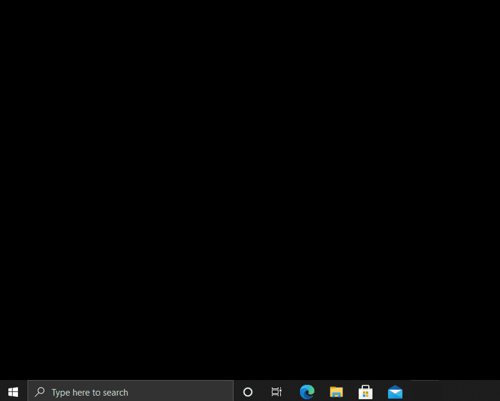
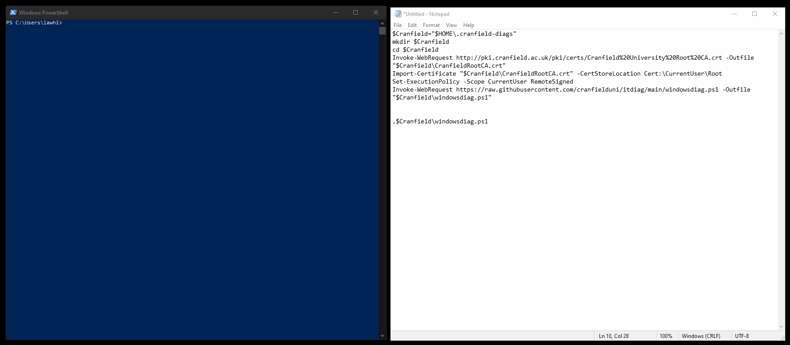
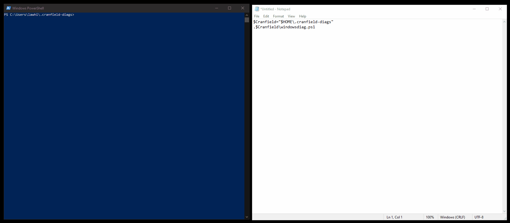

**Usage**

The script is for Windows 10 PCs and is run using Microsoft Powershell (included with Windows by default)

**1. Launch Powershell**

[
*click to enlarge*](assets/loadpowershell.gif)

**2. Copy and Run Setup Script (first time only)**

Copy the below script:
```powershell
$Cranfield="$HOME\.cranfield-diags"
mk $Cranfield
cd $Cranfield
Invoke-WebRequest http://pki.cranfield.ac.uk/pki/certs/Cranfield%20University%20Root%20CA.crt -Outfile "$Cranfield\CranfieldRootCA.crt"
Import-Certificate "$Cranfield\CranfieldRootCA.crt" -CertStoreLocation Cert:\CurrentUser\Root
Set-ExecutionPolicy -Scope CurrentUser RemoteSigned
Invoke-WebRequest https://raw.githubusercontent.com/cranfielduni/itdiag/main/windowsdiag.ps1 -Outfile "$Cranfield\windowsdiag.ps1"
```

Paste it into your Powershell window and follow onscreen prompts.  Hit `Enter` to run the final line

[
*click to enlarge*](assets/setup.gif)

**3. Copy and Run diagnostics script**

Copy the below script:
```powershell
$Cranfield="$HOME\.cranfield-diags"
.$Cranfield\windowsdiag.ps1
```
Paste it into your Powershell window and hit `Enter` to run

[
*click to enlarge*](assets/running.gif)

**4. Make a note of the results locations**

These will need to be supplied to IT staff for them to view your results
